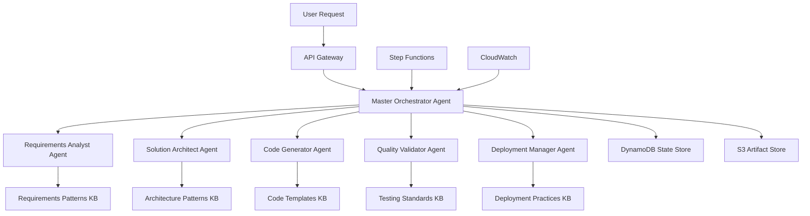
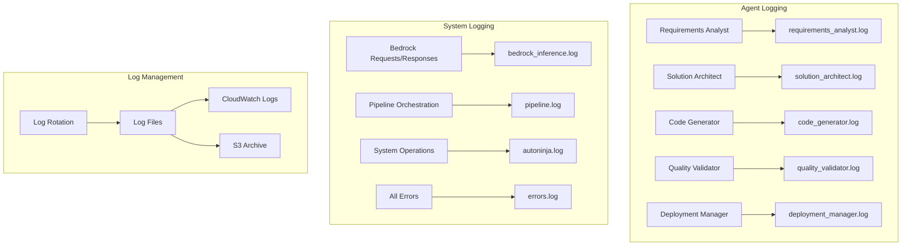

# AutoNinja AWS Bedrock - Design Document

## Overview

AutoNinja AWS Bedrock is a serverless, multi-agent system built on Amazon Bedrock that transforms natural language requests into production-ready AI agents. The system leverages Bedrock's native multi-agent collaboration framework, AgentCore runtime services, and managed knowledge bases to orchestrate a pipeline of specialized agents that analyze requirements, design architecture, generate code, validate quality, and prepare deployment artifacts.

The design follows a hierarchical multi-agent pattern with a Master Orchestrator supervising five specialized collaborator agents, each optimized for specific domain expertise. The system is fully AWS-native, serverless-first, and designed for enterprise-scale deployment with built-in security, compliance, and observability.

## Architecture

### High-Level Architecture



### Agent Hierarchy and Communication

The system implements LangChain's multi-agent orchestration pattern with:

- **LangGraph Orchestrator**: Coordinates the entire workflow using state graphs
- **LangChain Agents**: Five specialist agents, each with domain-specific tools and capabilities
- **Tool Calling**: Direct tool invocation via LangChain's tool calling framework
- **State Management**: LangGraph state persistence with DynamoDB backend
- **Workflow Execution**: LangGraph manages complex multi-step workflows with conditional logic

### Core Services Integration

**Amazon Bedrock Services:**
- Bedrock Models: Claude 4.5 Sonnet for complex reasoning, Claude 4.1 Opus for advanced tasks
- Bedrock Knowledge Bases: Dynamically populated with agent-generated patterns and templates
- Bedrock Guardrails: Content filtering and safety controls

**LangChain Framework:**
- LangGraph: Multi-agent workflow orchestration with state graphs
- LangChain Agents: Individual agent implementations with tool calling
- LangChain Tools: AWS service integrations and custom tools
- LangChain Memory: Conversation and context management

**Amazon Bedrock AgentCore Services:**
- AgentCore Runtime: Serverless hosting for LangChain-based agent execution
- AgentCore Memory: Context-aware interactions and session persistence
- AgentCore Identity: Secure agent identity and access management
- AgentCore Gateway: Tool integration and API transformation
- AgentCore Observability: Comprehensive monitoring and tracing

**LangChain Integration:**
- LangGraph: Multi-agent workflow orchestration and state management
- LangChain Agents: Individual agent implementations with tool calling
- LangChain Memory: Conversation and context management
- LangChain Tools: Integration with AWS services and APIs

## LangChain Orchestration Architecture

### LangGraph Workflow Design

```python
from langgraph.graph import StateGraph, END
from langchain_aws import ChatBedrock
from typing import TypedDict, List

class AutoNinjaState(TypedDict):
    user_request: str
    session_id: str
    requirements: dict
    architecture: dict
    generated_code: dict
    validation_results: dict
    deployment_config: dict
    final_artifacts: dict
    current_step: str
    errors: List[str]

def create_autoninja_workflow():
    workflow = StateGraph(AutoNinjaState)
    
    # Add nodes for each specialist agent
    workflow.add_node("requirements_analyst", requirements_analyst_node)
    workflow.add_node("solution_architect", solution_architect_node)
    workflow.add_node("code_generator", code_generator_node)
    workflow.add_node("quality_validator", quality_validator_node)
    workflow.add_node("deployment_manager", deployment_manager_node)
    
    # Define the workflow edges
    workflow.set_entry_point("requirements_analyst")
    workflow.add_edge("requirements_analyst", "solution_architect")
    workflow.add_edge("solution_architect", "code_generator")
    workflow.add_edge("code_generator", "quality_validator")
    workflow.add_edge("quality_validator", "deployment_manager")
    workflow.add_edge("deployment_manager", END)
    
    return workflow.compile()
```

### LangChain Agent Implementations

Each specialist agent is implemented as a LangChain agent with specific tools and capabilities:

```python
from langchain.agents import create_tool_calling_agent
from langchain_aws import ChatBedrock
from langchain.tools import Tool

def create_requirements_analyst_agent():
    llm = ChatBedrock(
        model_id="us.anthropic.claude-sonnet-4-5-20250929-v1:0",
        region_name="us-east-2"
    )
    
    tools = [
        knowledge_base_query_tool,
        requirements_extraction_tool,
        compliance_checker_tool
    ]
    
    return create_tool_calling_agent(llm, tools, system_prompt)
```

## Logging and Observability Architecture

### Comprehensive Logging System

The system implements a multi-layered logging architecture that provides complete visibility into agent operations, Bedrock interactions, and pipeline execution:



### Logging Configuration

Each agent maintains dedicated log files with structured logging:

- **Agent-Specific Logs**: Each agent writes to `{agent_name}.log` with execution traces, input/output data, and processing steps
- **Bedrock Inference Logs**: All raw Bedrock API requests and responses logged to `bedrock_inference.log` with execution IDs
- **Pipeline Logs**: Multi-agent orchestration and workflow state changes logged to `pipeline.log`
- **Error Logs**: All exceptions and error conditions centralized in `errors.log`
- **System Logs**: General application logs and cross-cutting concerns in `autoninja.log`

### Log Structure and Format

All logs follow a structured format with:
- **Timestamp**: ISO 8601 format with timezone
- **Execution ID**: Unique identifier for tracing requests across agents
- **Session ID**: Session-level identifier for multi-request workflows
- **Agent Name**: Source agent for the log entry
- **Log Level**: DEBUG, INFO, WARNING, ERROR, CRITICAL
- **Message**: Structured log message with context
- **Metadata**: Additional context including model IDs, processing times, and performance metrics

## Components and Interfaces

### 1. Master Orchestrator Agent

**Purpose**: Central coordinator implementing supervisor pattern for multi-agent collaboration

**Configuration**:
```python
{
    "agent_name": "AutoNinja-Master-Orchestrator",
    "foundation_model": "us.anthropic.claude-sonnet-4-5-20250929-v1:0",
    "instruction": """You are the Master Orchestrator for AutoNinja, responsible for coordinating 
    specialized agents to generate production-ready AI agents for any user - business, personal, 
    or individual. Analyze user requests, create execution plans, delegate tasks to appropriate 
    collaborator agents, and assemble final results that can be immediately deployed.""",
    "collaborator_agents": [
        "requirements-analyst",
        "solution-architect", 
        "code-generator",
        "quality-validator",
        "deployment-manager"
    ]
}
```

**Action Groups**:
- Workflow Management: Plan creation, task delegation, progress tracking
- State Management: Session persistence, progress updates, error recovery
- Quality Control: Validation checkpoints, approval gates
- Artifact Assembly: Final package creation, metadata generation

**Interfaces**:
- Input: User requests via API Gateway
- Output: Complete agent generation results with artifacts
- Internal: Collaborator agent invocations, state management

### 2. Requirements Analyst Agent

**Purpose**: Natural language processing and requirements extraction

**Configuration**:
```python
{
    "agent_name": "AutoNinja-Requirements-Analyst",
    "foundation_model": "us.anthropic.claude-sonnet-4-5-20250929-v1:0",
    "instruction": """You are a Requirements Analyst specializing in extracting and structuring 
    requirements from natural language descriptions for any type of user. Analyze user requests, 
    identify functional and non-functional requirements, assess compliance needs, and generate 
    structured specifications for real AI agents.""",
    "knowledge_bases": ["requirements-patterns-kb"]
}
```

**Action Groups**:
- Intent Analysis: Natural language processing, requirement extraction
- Compliance Checking: Regulatory framework identification
- Documentation Generation: Structured requirement specifications

**Knowledge Base Integration**:
- Dynamic Pattern Generation: Agent creates and updates patterns based on successful generations

### 3. Solution Architect Agent

**Purpose**: AWS-native architecture design and service selection

**Configuration**:
```python
{
    "agent_name": "AutoNinja-Solution-Architect", 
    "foundation_model": "us.anthropic.claude-opus-4-1-20250805-v1:0",
    "instruction": """You are a Solution Architect specializing in AWS Bedrock Agent architectures. 
    Design optimal Bedrock Agent configurations, create action groups, integrate knowledge bases, 
    and generate CloudFormation templates for real AI agent deployment.""",
    "knowledge_bases": ["architecture-patterns-kb"]
}
```

**Action Groups**:
- Architecture Design: Service selection, pattern application
- Security Planning: IAM design, encryption strategies
- IaC Generation: CloudFormation/CDK template creation
- Cost Optimization: Service configuration optimization

**Knowledge Base Integration**:
- Dynamic Architecture Patterns: Agent generates and refines architecture patterns from successful deployments

### 4. Code Generator Agent

**Purpose**: Production-ready code generation with AWS SDK integration

**Configuration**:
```python
{
    "agent_name": "AutoNinja-Code-Generator",
    "foundation_model": "us.anthropic.claude-opus-4-1-20250805-v1:0", 
    "instruction": """You are a Code Generator specializing in Bedrock Agent implementations. Generate 
    production-ready agent configurations, action group implementations, knowledge base integrations, 
    and CloudFormation templates for real AI agent deployment.""",
    "knowledge_bases": ["code-templates-kb"]
}
```

**Action Groups**:
- Code Generation: Multi-language code creation
- SDK Integration: AWS service integration code
- Configuration Creation: Service configurations, environment setup
- Documentation Generation: Code documentation, API specs

**Knowledge Base Integration**:
- Dynamic Code Templates: Agent creates and evolves code templates from successful generations

### 5. Quality Validator Agent

**Purpose**: Comprehensive quality assurance and compliance validation

**Configuration**:
```python
{
    "agent_name": "AutoNinja-Quality-Validator",
    "foundation_model": "us.anthropic.claude-sonnet-4-5-20250929-v1:0",
    "instruction": """You are a Quality Validator responsible for comprehensive Bedrock Agent 
    validation. Validate agent configurations, action group implementations, knowledge base 
    integrations, and CloudFormation templates for production readiness.""",
    "knowledge_bases": ["testing-standards-kb"]
}
```

**Action Groups**:
- Code Analysis: Static analysis, quality metrics
- Security Scanning: Vulnerability assessment, security best practices
- Performance Testing: Performance analysis, optimization recommendations
- Compliance Validation: Regulatory compliance verification

**Knowledge Base Integration**:
- Dynamic Testing Standards: Agent develops and improves testing patterns from validation results

### 6. Deployment Manager Agent

**Purpose**: Deployment automation and operational setup

**Configuration**:
```python
{
    "agent_name": "AutoNinja-Deployment-Manager",
    "foundation_model": "us.anthropic.claude-sonnet-4-5-20250929-v1:0",
    "instruction": """You are a Deployment Manager responsible for deploying real Bedrock Agents. 
    Generate CloudFormation templates, execute deployments, create monitoring configurations, 
    and provide operational documentation for the deployed agents.""",
    "knowledge_bases": ["deployment-practices-kb"]
}
```

**Action Groups**:
- Pipeline Generation: CI/CD pipeline creation
- Deployment Packaging: Artifact packaging, versioning
- Monitoring Setup: CloudWatch configuration, alerting
- Documentation Assembly: Deployment guides, operational runbooks

**Knowledge Base Integration**:
- Dynamic Deployment Practices: Agent learns and optimizes deployment patterns from operational feedback

## Data Models

### Session State Model

```python
{
    "session_id": "uuid",
    "user_request": {
        "request_type": "generate_agent",
        "specifications": {
            "agent_name": "string",
            "agent_type": "conversational|analytical|automation|custom",
            "description": "string",
            "requirements": {
                "functional": ["array"],
                "non_functional": {
                    "performance": {},
                    "security": {},
                    "compliance": []
                }
            },
            "target_platform": {
                "deployment": "bedrock-agent",
                "language": "python|nodejs|java",
                "framework": "optional"
            },
            "integrations": ["array"],
            "constraints": {
                "budget": "optional",
                "timeline": "optional"
            }
        }
    },
    "current_stage": "requirements|architecture|generation|validation|deployment",
    "agent_outputs": {
        "requirements_analyst": {},
        "solution_architect": {},
        "code_generator": {},
        "quality_validator": {},
        "deployment_manager": {}
    },
    "validation_results": {
        "code_quality_score": "number",
        "security_score": "number", 
        "compliance_checks": "string",
        "performance_estimate": {}
    },
    "artifacts_location": {
        "source_code": "s3://bucket/path",
        "infrastructure": "s3://bucket/path",
        "documentation": "s3://bucket/path",
        "deployment_package": "s3://bucket/path"
    },
    "generation_metadata": {
        "start_time": "timestamp",
        "end_time": "timestamp",
        "generation_time": "seconds",
        "bedrock_invocations": "count",
        "total_cost": "amount"
    },
    "status": "in_progress|completed|failed",
    "error_details": {}
}
```

### Dynamic Knowledge Base Schema

```python
{
    "kb_id": "string",
    "kb_name": "string", 
    "kb_type": "dynamic_patterns|dynamic_templates|dynamic_standards",
    "learning_metadata": {
        "generation_count": "number",
        "success_rate": "percentage",
        "last_pattern_update": "timestamp",
        "confidence_score": "number"
    },
    "dynamic_documents": [
        {
            "pattern_id": "string",
            "pattern_type": "requirements|architecture|code|testing|deployment",
            "content": "string",
            "generation_context": {
                "source_requests": ["array"],
                "success_metrics": {},
                "usage_frequency": "number"
            },
            "auto_generated": True,
            "last_refined": "timestamp"
        }
    ],
    "vector_store_configuration": {
        "embedding_model": "amazon.titan-embed-text-v1",
        "dimensions": 1536,
        "similarity_metric": "cosine"
    }
}
```

### Dynamic Learning System

```python
class DynamicPatternLearner:
    def __init__(self):
        self.pattern_store = DynamoDBPatternStore()
        self.knowledge_base = BedrockKnowledgeBase()
    
    def learn_from_successful_generation(self, generation_result):
        """Extract patterns from successful agent generations"""
        patterns = self.extract_patterns(generation_result)
        
        for pattern in patterns:
            existing_pattern = self.find_similar_pattern(pattern)
            
            if existing_pattern:
                self.refine_existing_pattern(existing_pattern, pattern)
            else:
                self.create_new_pattern(pattern)
    
    def generate_template_for_request(self, user_request):
        """Dynamically generate templates based on request analysis"""
        similar_patterns = self.find_relevant_patterns(user_request)
        return self.synthesize_template(similar_patterns, user_request)
    
    def update_knowledge_base(self, new_patterns):
        """Update Bedrock Knowledge Base with new patterns"""
        for pattern in new_patterns:
            self.knowledge_base.add_document(
                content=pattern.content,
                metadata=pattern.metadata
            )
```

### Agent Output Schema

```python
{
    "agent_name": "string",
    "execution_id": "string",
    "input": {},
    "output": {
        "result": {},
        "confidence_score": "number",
        "reasoning": "string",
        "recommendations": ["array"]
    },
    "execution_metadata": {
        "start_time": "timestamp",
        "end_time": "timestamp",
        "duration": "seconds",
        "model_invocations": "count",
        "tokens_used": "count"
    },
    "trace_data": {
        "trace_id": "string",
        "steps": ["array"]
    }
}
```

## Error Handling

### Circuit Breaker Pattern

Implement circuit breakers for all Bedrock service calls:

```python
class BedrockCircuitBreaker:
    def __init__(self, failure_threshold=5, recovery_timeout=60):
        self.failure_threshold = failure_threshold
        self.recovery_timeout = recovery_timeout
        self.failure_count = 0
        self.last_failure_time = None
        self.state = "CLOSED"  # CLOSED, OPEN, HALF_OPEN
    
    def call_bedrock_agent(self, agent_id, input_data):
        if self.state == "OPEN":
            if time.time() - self.last_failure_time > self.recovery_timeout:
                self.state = "HALF_OPEN"
            else:
                raise CircuitBreakerOpenException()
        
        try:
            response = bedrock_agent_runtime.invoke_agent(
                agentId=agent_id,
                sessionId=input_data['session_id'],
                inputText=input_data['input_text']
            )
            self.reset()
            return response
        except Exception as e:
            self.record_failure()
            raise e
```

### Retry Logic with Exponential Backoff

```python
@retry(
    stop=stop_after_attempt(3),
    wait=wait_exponential(multiplier=1, min=4, max=10),
    retry=retry_if_exception_type((ThrottlingException, ServiceUnavailableException))
)
def invoke_agent_with_retry(agent_id, session_id, input_text):
    return bedrock_agent_runtime.invoke_agent(
        agentId=agent_id,
        sessionId=session_id,
        inputText=input_text
    )
```

### Error Recovery Strategies

1. **Agent Failure Recovery**: Retry with alternative models or simplified prompts
2. **Knowledge Base Fallback**: Use cached responses or alternative knowledge sources
3. **Partial Success Handling**: Continue workflow with available results
4. **State Persistence**: Maintain recovery checkpoints in DynamoDB

## Testing Strategy

### Unit Testing

Each agent component will have comprehensive unit tests:

```python
class TestRequirementsAnalystAgent:
    def test_requirement_extraction(self):
        # Test natural language requirement extraction
        pass
    
    def test_compliance_identification(self):
        # Test compliance framework detection
        pass
    
    def test_output_format_validation(self):
        # Test structured output format
        pass
```

### Integration Testing

Test agent-to-agent communication and data flow:

```python
class TestAgentPipeline:
    def test_orchestrator_to_analyst_flow(self):
        # Test Master Orchestrator -> Requirements Analyst
        pass
    
    def test_analyst_to_architect_flow(self):
        # Test Requirements Analyst -> Solution Architect
        pass
    
    def test_end_to_end_pipeline(self):
        # Test complete pipeline execution
        pass
```

### Code Quality Validation

Automated linting and validation for all generated code:

```python
def validate_generated_python_code(code_content):
    # Run pylint
    pylint_result = run_pylint(code_content)
    
    # Run black formatter check
    black_result = run_black_check(code_content)
    
    # Run mypy type checking
    mypy_result = run_mypy(code_content)
    
    return {
        "pylint_score": pylint_result.score,
        "black_compliant": black_result.compliant,
        "mypy_errors": mypy_result.errors
    }
```

### Infrastructure Validation

Validate generated CloudFormation/CDK templates:

```python
def validate_cloudformation_template(template_content):
    # AWS CLI validation
    cli_result = run_cfn_validate(template_content)
    
    # cfn-lint validation
    lint_result = run_cfn_lint(template_content)
    
    return {
        "aws_validation": cli_result.valid,
        "lint_errors": lint_result.errors,
        "security_warnings": lint_result.security_warnings
    }
```

## Security Architecture

### Identity and Access Management

```python
# Agent execution roles with least privilege
{
    "MasterOrchestratorRole": {
        "policies": [
            "BedrockAgentInvokePolicy",
            "DynamoDBStateManagementPolicy", 
            "S3ArtifactAccessPolicy",
            "StepFunctionsExecutionPolicy"
        ]
    },
    "SpecialistAgentRole": {
        "policies": [
            "BedrockKnowledgeBaseAccessPolicy",
            "BedrockModelInvokePolicy",
            "CloudWatchLogsPolicy"
        ]
    }
}
```

### Data Encryption

- **At Rest**: All DynamoDB tables and S3 buckets encrypted with KMS
- **In Transit**: TLS 1.2+ for all API communications
- **Agent Memory**: AgentCore Memory with encryption enabled

### Network Security

```python
# VPC configuration for secure deployment
{
    "vpc_configuration": {
        "subnet_ids": ["private-subnet-1", "private-subnet-2"],
        "security_group_ids": ["bedrock-agents-sg"],
        "enable_private_link": True
    }
}
```

### Guardrails Integration

```python
# Bedrock Guardrails configuration
{
    "guardrail_configuration": {
        "guardrail_id": "autoninja-content-filter",
        "guardrail_version": "1",
        "content_filters": [
            {"type": "HATE", "strength": "HIGH"},
            {"type": "INSULTS", "strength": "HIGH"},
            {"type": "SEXUAL", "strength": "HIGH"},
            {"type": "VIOLENCE", "strength": "MEDIUM"}
        ],
        "topic_filters": [
            {"name": "malicious_code", "type": "DENY"}
        ]
    }
}
```

## Performance Optimization

### Caching Strategy

```python
# ElastiCache for frequently accessed patterns
class PatternCache:
    def __init__(self):
        self.redis_client = redis.Redis(host='elasticache-endpoint')
    
    def get_architecture_pattern(self, pattern_key):
        cached_pattern = self.redis_client.get(f"arch:{pattern_key}")
        if cached_pattern:
            return json.loads(cached_pattern)
        return None
    
    def cache_architecture_pattern(self, pattern_key, pattern_data, ttl=3600):
        self.redis_client.setex(
            f"arch:{pattern_key}", 
            ttl, 
            json.dumps(pattern_data)
        )
```

### Bedrock Agent Optimization

```python
# Agent configuration for optimal performance
{
    "agent_configurations": {
        "master_orchestrator": {
            "model": "us.anthropic.claude-sonnet-4-5-20250929-v1:0",
            "timeout": 300
        },
        "specialist_agents": {
            "model": "us.anthropic.claude-sonnet-4-5-20250929-v1:0",
            "timeout": 180
        }
    }
}
```

### Bedrock Optimization

```python
# Model selection based on task complexity
def select_optimal_model(task_complexity):
    if task_complexity == "high":
        return "anthropic.claude-3-sonnet-20240229-v1:0"
    elif task_complexity == "medium":
        return "anthropic.claude-3-haiku-20240307-v1:0"
    else:
        return "anthropic.claude-3-haiku-20240307-v1:0"
```

## Monitoring and Observability

### CloudWatch Metrics

```python
# Custom metrics for agent performance
metrics = [
    "AgentGenerationTime",
    "AgentSuccessRate", 
    "BedrockInvocationCount",
    "KnowledgeBaseQueryLatency",
    "CodeQualityScore",
    "SecurityScore"
]
```

### X-Ray Tracing

```python
# Distributed tracing across agent pipeline
@xray_recorder.capture('agent_invocation')
def invoke_specialist_agent(agent_name, input_data):
    subsegment = xray_recorder.begin_subsegment(f'invoke_{agent_name}')
    try:
        response = bedrock_client.invoke_agent(
            agentId=agent_configs[agent_name]['id'],
            sessionId=input_data['session_id'],
            inputText=input_data['input_text']
        )
        subsegment.put_metadata('agent_response', response)
        return response
    finally:
        xray_recorder.end_subsegment()
```

### AgentCore Observability

```python
# Comprehensive agent monitoring
{
    "observability_config": {
        "enable_detailed_tracing": True,
        "log_level": "INFO",
        "metrics_namespace": "AutoNinja/Agents",
        "custom_dashboards": [
            "agent_performance_dashboard",
            "cost_optimization_dashboard",
            "security_compliance_dashboard"
        ]
    }
}
```

This design provides a comprehensive, production-ready architecture for AutoNinja AWS Bedrock that leverages the full capabilities of Amazon Bedrock's multi-agent collaboration framework and AgentCore services while maintaining enterprise-grade security, scalability, and observability.