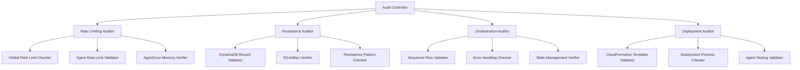
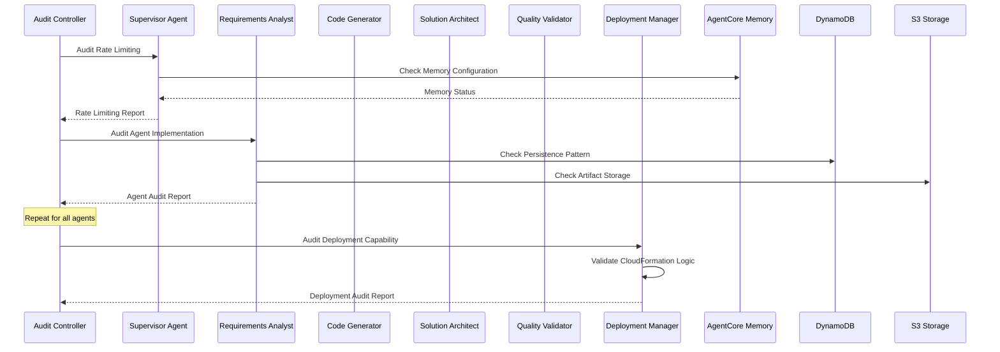
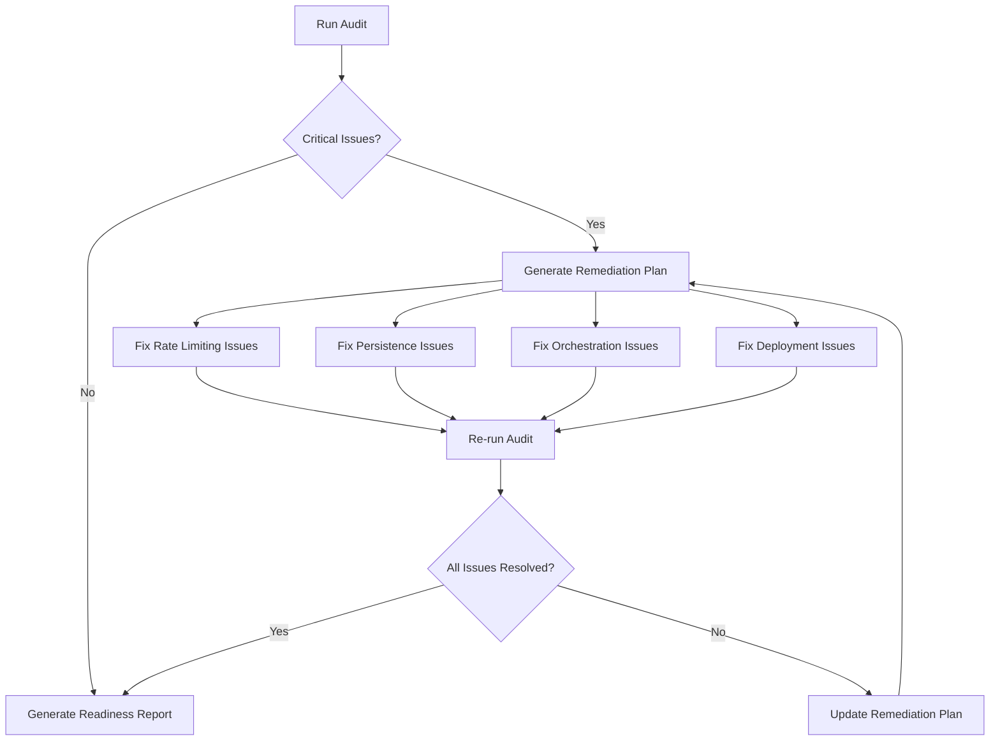

# E2E Test Readiness Audit Design

## Overview

This design document outlines a comprehensive audit system for verifying AutoNinja's readiness for end-to-end testing. The audit identifies critical gaps in the current implementation and provides systematic verification of rate limiting, persistence, orchestration, and deployment capabilities.

Based on code analysis, several critical issues have been identified:
1. **Missing Rate Limiting in Individual Agents**: Only requirements-analyst implements `enforce_rate_limit_before_call`
2. **Inconsistent AgentCore Memory Usage**: Supervisor has rate limiting logic but individual agents don't use it
3. **Incomplete Error Handling**: Some agents lack proper error logging to DynamoDB
4. **Missing Deployment Validation**: No actual CloudFormation deployment or testing occurs

## Architecture

### Audit Framework Components



### System Integration Points



## Components and Interfaces

### 1. Audit Controller

**Purpose**: Orchestrates all audit activities and generates comprehensive reports.

**Interface**:
```python
class AuditController:
    def run_full_audit(self) -> AuditReport
    def audit_rate_limiting(self) -> RateLimitingReport
    def audit_persistence(self) -> PersistenceReport
    def audit_orchestration(self) -> OrchestrationReport
    def audit_deployment(self) -> DeploymentReport
```

**Key Responsibilities**:
- Coordinate all audit components
- Generate consolidated reports
- Identify critical vs. non-critical issues
- Provide remediation recommendations

### 2. Rate Limiting Auditor

**Purpose**: Verifies global rate limiting implementation across all agents.

**Critical Issues Identified**:
- Only `requirements-analyst` calls `enforce_rate_limit_before_call`
- `code-generator` and `deployment-manager` have no rate limiting
- Supervisor has rate limiting logic but may have AgentCore Memory configuration issues

**Audit Checks**:
```python
class RateLimitingAuditor:
    def check_global_rate_limiter(self) -> bool
    def verify_agentcore_memory_config(self) -> bool
    def audit_agent_rate_limiting(self, agent_name: str) -> AgentRateLimitReport
    def test_rate_limit_enforcement(self) -> bool
```

**Verification Process**:
1. **AgentCore Memory Configuration**: Verify MEMORY_ID environment variable and namespace setup
2. **Individual Agent Implementation**: Check each agent for `enforce_rate_limit_before_call` usage
3. **Rate Limit Logic**: Validate 30-second interval enforcement
4. **Error Handling**: Ensure graceful degradation when rate limiting fails

### 3. Persistence Auditor

**Purpose**: Validates DynamoDB and S3 persistence patterns across all agents.

**Critical Issues Identified**:
- Inconsistent error logging patterns
- Missing DynamoDB record updates in some error paths
- Potential S3 artifact organization issues

**Audit Checks**:
```python
class PersistenceAuditor:
    def verify_dynamodb_patterns(self, agent_name: str) -> DynamoDBReport
    def verify_s3_patterns(self, agent_name: str) -> S3Report
    def check_error_logging(self, agent_name: str) -> ErrorLoggingReport
    def validate_artifact_structure(self) -> ArtifactStructureReport
```

**Verification Process**:
1. **DynamoDB Pattern Compliance**: Verify all agents log input immediately and update with output
2. **S3 Artifact Storage**: Check proper file organization and content types
3. **Error Handling**: Ensure all error paths log to DynamoDB
4. **Data Integrity**: Validate complete request/response pairs

### 4. Orchestration Auditor

**Purpose**: Verifies supervisor orchestration logic and agent sequence management.

**Critical Issues Identified**:
- Supervisor may not properly wait for agent completion
- Error handling in orchestration flow needs validation
- Agent sequence enforcement verification needed

**Audit Checks**:
```python
class OrchestrationAuditor:
    def verify_agent_sequence(self) -> SequenceReport
    def check_error_propagation(self) -> ErrorPropagationReport
    def validate_state_management(self) -> StateManagementReport
    def test_failure_scenarios(self) -> FailureScenarioReport
```

**Verification Process**:
1. **Sequence Enforcement**: Validate agents execute in correct order
2. **Completion Waiting**: Ensure supervisor waits for full agent completion
3. **Error Handling**: Verify proper error propagation and halt conditions
4. **State Consistency**: Check state management across agent transitions

### 5. Deployment Auditor

**Purpose**: Validates deployment manager capabilities and CloudFormation integration.

**Critical Issues Identified**:
- Deployment manager uses simulated deployment, not actual CloudFormation
- No real agent testing occurs
- Missing validation of deployed agent functionality

**Audit Checks**:
```python
class DeploymentAuditor:
    def validate_cloudformation_templates(self) -> CloudFormationReport
    def check_deployment_process(self) -> DeploymentProcessReport
    def verify_agent_testing(self) -> AgentTestingReport
    def validate_success_criteria(self) -> SuccessCriteriaReport
```

**Verification Process**:
1. **Template Validation**: Check CloudFormation template syntax and completeness
2. **Deployment Logic**: Verify actual deployment capability vs. simulation
3. **Agent Testing**: Validate deployed agent invocation and response
4. **Success Metrics**: Ensure proper success/failure determination

## Data Models

### Audit Report Structure

```python
@dataclass
class AuditReport:
    timestamp: datetime
    overall_status: AuditStatus
    critical_issues: List[CriticalIssue]
    warnings: List[Warning]
    recommendations: List[Recommendation]
    component_reports: Dict[str, ComponentReport]
    readiness_score: float
    
@dataclass
class CriticalIssue:
    component: str
    issue_type: str
    description: str
    impact: str
    remediation: str
    blocking_e2e: bool

@dataclass
class ComponentReport:
    component_name: str
    status: ComponentStatus
    checks_passed: int
    checks_failed: int
    issues: List[Issue]
    recommendations: List[str]
```

### Rate Limiting Report

```python
@dataclass
class RateLimitingReport:
    agentcore_memory_configured: bool
    global_rate_limiter_functional: bool
    agent_implementations: Dict[str, AgentRateLimitStatus]
    critical_gaps: List[str]
    
@dataclass
class AgentRateLimitStatus:
    agent_name: str
    has_rate_limiting: bool
    uses_enforce_function: bool
    handles_errors: bool
    issues: List[str]
```

## Error Handling

### Audit Error Categories

1. **Configuration Errors**: Missing environment variables, incorrect AgentCore Memory setup
2. **Implementation Gaps**: Missing rate limiting, incomplete persistence patterns
3. **Integration Issues**: AgentCore Memory connectivity, DynamoDB/S3 access problems
4. **Logic Errors**: Incorrect orchestration flow, improper error handling

### Error Recovery Strategies

```python
class AuditErrorHandler:
    def handle_configuration_error(self, error: ConfigurationError) -> RecoveryAction
    def handle_implementation_gap(self, gap: ImplementationGap) -> RecommendedFix
    def handle_integration_issue(self, issue: IntegrationIssue) -> DiagnosticAction
    def handle_logic_error(self, error: LogicError) -> ValidationAction
```

## Testing Strategy

### Audit Validation Approach

1. **Static Code Analysis**: Scan agent implementations for required patterns
2. **Configuration Validation**: Verify environment variables and AWS resource access
3. **Integration Testing**: Test AgentCore Memory, DynamoDB, and S3 connectivity
4. **Behavioral Testing**: Simulate orchestration scenarios to validate flow
5. **End-to-End Simulation**: Run controlled E2E scenarios to identify gaps

### Test Scenarios

```python
class AuditTestScenarios:
    def test_rate_limiting_enforcement(self) -> TestResult
    def test_persistence_patterns(self) -> TestResult
    def test_orchestration_flow(self) -> TestResult
    def test_error_handling(self) -> TestResult
    def test_deployment_validation(self) -> TestResult
```

### Remediation Workflow



## Implementation Priorities

### Phase 1: Critical Gap Analysis
1. Identify all agents missing rate limiting implementation
2. Verify AgentCore Memory configuration in supervisor
3. Validate DynamoDB persistence patterns across all agents
4. Check S3 artifact storage consistency

### Phase 2: Implementation Fixes
1. Add rate limiting to code-generator and deployment-manager
2. Fix AgentCore Memory configuration issues
3. Standardize error logging patterns
4. Implement actual CloudFormation deployment logic

### Phase 3: Validation and Testing
1. Run comprehensive audit suite
2. Execute controlled E2E test scenarios
3. Validate all remediation fixes
4. Generate final readiness certification

## Success Metrics

### Readiness Criteria
- **Rate Limiting**: 100% of agents implement proper rate limiting
- **Persistence**: 100% of agents follow DynamoDB and S3 patterns
- **Orchestration**: Supervisor correctly manages all agent sequences
- **Deployment**: Actual CloudFormation deployment and agent testing works
- **E2E Test**: Complete test passes with deployed working agent

### Audit Score Calculation
```python
def calculate_readiness_score(audit_results: AuditReport) -> float:
    weights = {
        'rate_limiting': 0.25,
        'persistence': 0.25,
        'orchestration': 0.25,
        'deployment': 0.25
    }
    
    component_scores = {}
    for component, report in audit_results.component_reports.items():
        component_scores[component] = report.checks_passed / (report.checks_passed + report.checks_failed)
    
    weighted_score = sum(weights[comp] * score for comp, score in component_scores.items())
    return weighted_score * 100  # Convert to percentage
```

A score of 95% or higher indicates E2E test readiness.