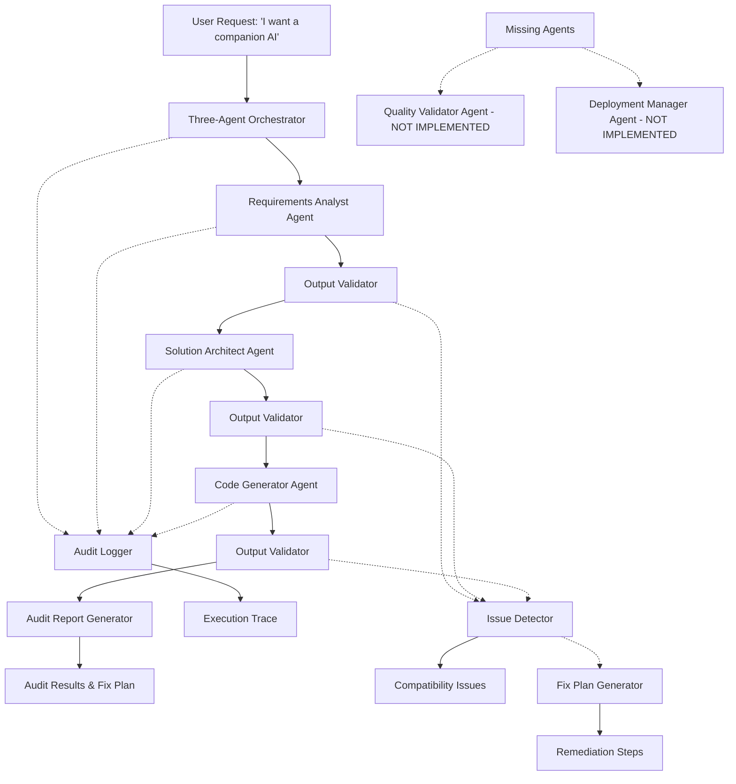

# Design Document

## Overview

The Multi-Agent Audit System provides comprehensive validation, orchestration, and monitoring for the AutoNinja AWS Bedrock agent pipeline. Currently, three agents are implemented (Requirements Analyst, Solution Architect, Code Generator) with two additional agents needed (Quality Validator, Deployment Manager) to complete the full pipeline.

The audit system focuses on:
1. **Auditing Current Agents**: Validate that the three existing agents produce compatible outputs and work together correctly
2. **Identifying Issues**: Find gaps, incompatibilities, or missing functionality in agent interactions
3. **Creating Fix Plans**: Generate specific remediation plans for any issues discovered
4. **Orchestration Testing**: Implement a three-agent orchestrator to test the current pipeline
5. **Gap Analysis**: Identify what's needed to complete the full five-agent pipeline

The design follows a modular architecture with clear separation between auditing, validation, orchestration, and fix planning concerns.

## Architecture

### Current State Architecture



### Component Architecture

The audit system consists of six main components:

1. **Three-Agent Orchestrator**: Manages execution flow for the current three agents
2. **Output Validator**: Validates agent outputs for structure and content compatibility
3. **Audit Logger**: Comprehensive logging of all interactions and transformations
4. **Issue Detector**: Identifies compatibility problems and missing functionality
5. **Fix Plan Generator**: Creates specific remediation plans for discovered issues
6. **Gap Analyzer**: Identifies what's needed to complete the five-agent pipeline

## Components and Interfaces

### Three-Agent Orchestrator

**Purpose**: Coordinates execution of the current three-agent pipeline (Requirements Analyst → Solution Architect → Code Generator) with proper error handling and state management.

**Key Classes**:
- `ThreeAgentOrchestrator`: Main orchestration logic for current three agents
- `PipelineState`: Tracks execution state and agent outputs
- `ExecutionContext`: Manages session context and metadata

**Interfaces**:
```python
class ThreeAgentOrchestrator:
    def execute_three_agent_pipeline(self, user_request: str, session_id: str) -> AuditResult
    def validate_current_agents(self) -> ValidationResult
    def get_execution_status(self, session_id: str) -> ExecutionStatus
    
class AuditResult:
    session_id: str
    execution_id: str
    final_output: AgentOutput
    execution_trace: List[AgentExecution]
    compatibility_issues: List[CompatibilityIssue]
    fix_plan: FixPlan
    gap_analysis: GapAnalysis
```

### Output Validator

**Purpose**: Validates agent outputs for structural compatibility and content quality.

**Key Classes**:
- `AgentOutputValidator`: Main validation logic
- `SchemaValidator`: Validates output structure against expected schemas
- `ContentValidator`: Validates semantic content and data flow
- `CompatibilityChecker`: Ensures outputs are compatible with next agent

**Interfaces**:
```python
class AgentOutputValidator:
    def validate_requirements_output(self, output: AgentOutput) -> ValidationResult
    def validate_architecture_output(self, output: AgentOutput) -> ValidationResult
    def validate_code_output(self, output: AgentOutput) -> ValidationResult
    def check_pipeline_compatibility(self, outputs: List[AgentOutput]) -> CompatibilityResult

class ValidationResult:
    is_valid: bool
    validation_errors: List[ValidationError]
    warnings: List[str]
    recommendations: List[str]
    compatibility_score: float
```

### Audit Logger

**Purpose**: Provides comprehensive logging and tracing of all pipeline activities.

**Key Classes**:
- `PipelineAuditLogger`: Main audit logging functionality
- `AgentInteractionLogger`: Logs individual agent interactions
- `DataTransformationLogger`: Logs data transformations between agents
- `ExecutionTracer`: Creates detailed execution traces

**Interfaces**:
```python
class PipelineAuditLogger:
    def log_pipeline_start(self, session_id: str, user_request: str) -> None
    def log_agent_execution(self, agent_name: str, input_data: Any, output_data: Any) -> None
    def log_validation_result(self, agent_name: str, validation: ValidationResult) -> None
    def log_pipeline_completion(self, session_id: str, result: PipelineResult) -> None
    def generate_execution_report(self, session_id: str) -> ExecutionReport
```

### Performance Monitor

**Purpose**: Monitors pipeline performance and identifies optimization opportunities.

**Key Classes**:
- `PipelinePerformanceMonitor`: Main performance monitoring
- `AgentMetricsCollector`: Collects individual agent metrics
- `BottleneckAnalyzer`: Identifies performance bottlenecks
- `TrendAnalyzer`: Analyzes performance trends over time

**Interfaces**:
```python
class PipelinePerformanceMonitor:
    def start_monitoring(self, session_id: str) -> None
    def record_agent_metrics(self, agent_name: str, metrics: AgentMetrics) -> None
    def analyze_bottlenecks(self, session_id: str) -> BottleneckReport
    def generate_performance_report(self, session_id: str) -> PerformanceReport

class AgentMetrics:
    execution_time: float
    bedrock_calls: int
    bedrock_response_time: float
    tokens_used: int
    memory_usage: float
    confidence_score: float
```

### Quality Assessor

**Purpose**: Evaluates the quality and appropriateness of agent outputs and overall pipeline results.

**Key Classes**:
- `OutputQualityAssessor`: Main quality assessment logic
- `RequirementsQualityChecker`: Assesses requirements extraction quality
- `ArchitectureQualityChecker`: Assesses architecture design quality
- `CodeQualityChecker`: Assesses generated code quality

**Interfaces**:
```python
class OutputQualityAssessor:
    def assess_requirements_quality(self, output: AgentOutput) -> QualityScore
    def assess_architecture_quality(self, output: AgentOutput) -> QualityScore
    def assess_code_quality(self, output: AgentOutput) -> QualityScore
    def assess_pipeline_quality(self, outputs: List[AgentOutput]) -> PipelineQualityReport

class QualityScore:
    overall_score: float
    completeness_score: float
    accuracy_score: float
    appropriateness_score: float
    recommendations: List[str]
    improvement_areas: List[str]
```

## Data Models

### Core Data Models

```python
@dataclass
class PipelineExecution:
    session_id: str
    execution_id: str
    user_request: str
    start_time: datetime
    end_time: Optional[datetime]
    status: ExecutionStatus
    agent_executions: List[AgentExecution]
    validation_results: List[ValidationResult]
    quality_assessment: Optional[QualityReport]
    performance_metrics: Optional[PerformanceReport]

@dataclass
class AgentExecution:
    agent_name: str
    execution_id: str
    input_data: Dict[str, Any]
    output_data: Optional[AgentOutput]
    start_time: datetime
    end_time: Optional[datetime]
    status: AgentStatus
    validation_result: Optional[ValidationResult]
    performance_metrics: Optional[AgentMetrics]

@dataclass
class ValidationError:
    field_name: str
    error_type: str
    error_message: str
    severity: str
    remediation_suggestion: str

@dataclass
class QualityReport:
    overall_quality_score: float
    requirements_quality: QualityScore
    architecture_quality: QualityScore
    code_quality: QualityScore
    pipeline_coherence_score: float
    recommendations: List[str]
```

### Configuration Models

```python
@dataclass
class PipelineConfig:
    agent_timeout_seconds: int = 300
    max_retries: int = 3
    validation_enabled: bool = True
    quality_assessment_enabled: bool = True
    performance_monitoring_enabled: bool = True
    log_level: str = "INFO"
    
@dataclass
class ValidationConfig:
    strict_schema_validation: bool = True
    content_validation_enabled: bool = True
    compatibility_threshold: float = 0.8
    required_fields_by_agent: Dict[str, List[str]]
    
@dataclass
class QualityConfig:
    minimum_quality_threshold: float = 0.7
    completeness_weight: float = 0.3
    accuracy_weight: float = 0.4
    appropriateness_weight: float = 0.3
```

## Error Handling

### Error Categories

1. **Agent Execution Errors**: Failures within individual agents
2. **Validation Errors**: Output structure or content validation failures
3. **Compatibility Errors**: Incompatible outputs between agents
4. **Configuration Errors**: Invalid system configuration
5. **Infrastructure Errors**: AWS service failures or network issues

### Error Handling Strategy

```python
class PipelineErrorHandler:
    def handle_agent_error(self, agent_name: str, error: Exception) -> ErrorResponse
    def handle_validation_error(self, validation_result: ValidationResult) -> ErrorResponse
    def handle_compatibility_error(self, compatibility_result: CompatibilityResult) -> ErrorResponse
    def should_retry(self, error: Exception) -> bool
    def get_recovery_strategy(self, error: Exception) -> RecoveryStrategy

class ErrorResponse:
    should_continue: bool
    retry_recommended: bool
    error_message: str
    remediation_steps: List[str]
    recovery_strategy: Optional[RecoveryStrategy]
```

### Recovery Mechanisms

1. **Automatic Retry**: For transient failures with exponential backoff
2. **Graceful Degradation**: Continue with reduced functionality when possible
3. **Error Reporting**: Comprehensive error reports for debugging
4. **State Recovery**: Ability to resume from last successful agent
5. **Fallback Strategies**: Alternative approaches when primary methods fail

## Testing Strategy

### Unit Testing

- **Component Testing**: Test each component (orchestrator, validator, logger, monitor, assessor) independently
- **Mock Integration**: Use mocks for agent interactions to test orchestration logic
- **Error Scenario Testing**: Test all error handling and recovery mechanisms
- **Configuration Testing**: Test various configuration scenarios and edge cases

### Integration Testing

- **Agent Integration**: Test real interactions between orchestrator and existing agents
- **End-to-End Validation**: Test complete pipeline with real agent outputs
- **Performance Testing**: Test performance monitoring and bottleneck detection
- **Quality Assessment Testing**: Test quality assessment with various output scenarios

### End-to-End Testing

- **Companion AI Demo**: Complete test with "I would like a companion AI" prompt
- **Multiple Scenarios**: Test with different types of AI agent requests
- **Error Recovery Testing**: Test pipeline behavior under various failure conditions
- **Performance Benchmarking**: Establish baseline performance metrics

### Test Data and Scenarios

```python
TEST_SCENARIOS = [
    {
        "name": "companion_ai",
        "prompt": "I would like a companion AI",
        "expected_requirements": ["conversational_ai", "memory_management", "personality"],
        "expected_services": ["Amazon Bedrock", "AWS Lambda", "API Gateway", "DynamoDB"],
        "expected_code_components": ["bedrock_agent_config", "conversation_handler", "memory_store"]
    },
    {
        "name": "data_analysis_agent",
        "prompt": "Create an AI agent that can analyze sales data",
        "expected_requirements": ["data_processing", "analytics", "reporting"],
        "expected_services": ["Amazon Bedrock", "AWS Lambda", "S3", "Athena"],
        "expected_code_components": ["data_processor", "analytics_engine", "report_generator"]
    }
]
```

## Implementation Phases

### Phase 1: Core Infrastructure
- Implement Pipeline Orchestrator with basic agent coordination
- Create Output Validator with schema validation
- Set up Audit Logger with basic logging functionality
- Implement configuration management system

### Phase 2: Validation and Quality
- Enhance Output Validator with content validation
- Implement Quality Assessor with scoring algorithms
- Add compatibility checking between agents
- Create comprehensive error handling and recovery

### Phase 3: Monitoring and Optimization
- Implement Performance Monitor with metrics collection
- Add bottleneck analysis and trend monitoring
- Create performance dashboards and alerting
- Optimize pipeline execution based on monitoring data

### Phase 4: Testing and Validation
- Implement comprehensive test suite
- Create companion AI demo scenario
- Add multiple test scenarios and edge cases
- Performance benchmarking and optimization

### Phase 5: Fix Planning and Implementation
- Generate specific fix plans for identified issues
- Implement fixes for agent compatibility problems
- Create recommendations for completing the five-agent pipeline
- Document gaps and requirements for Quality Validator and Deployment Manager agents