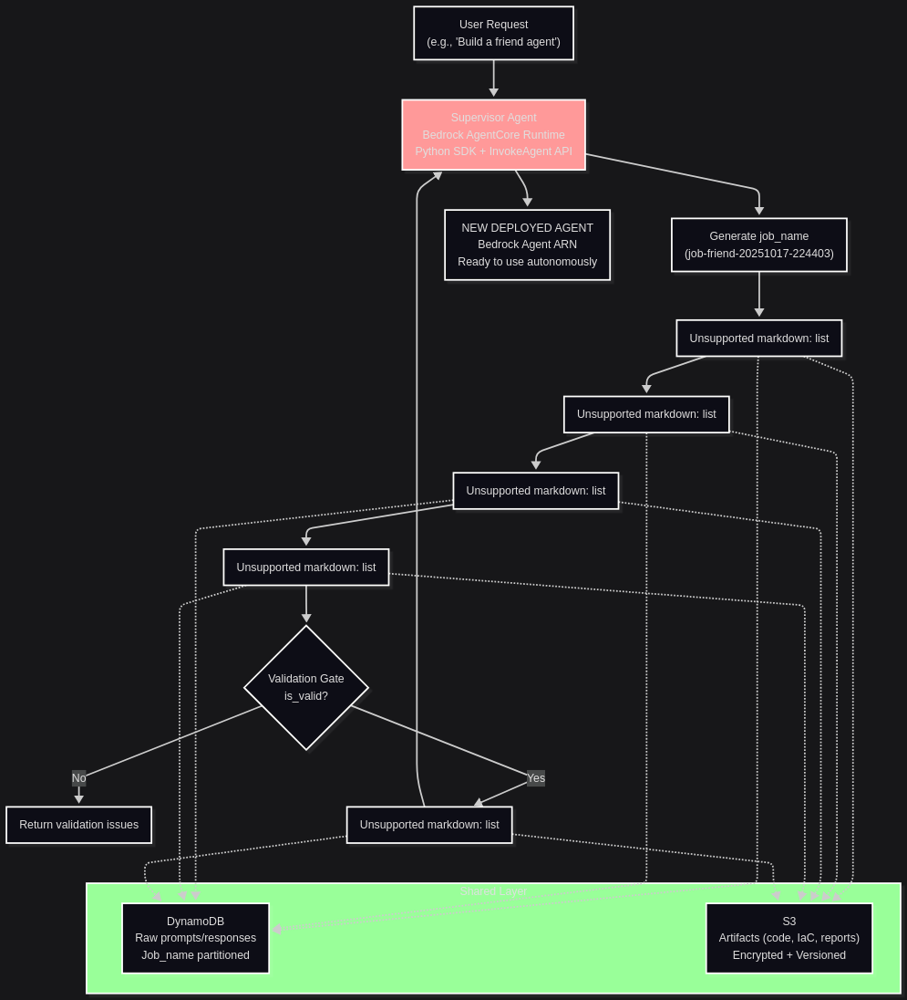

**AutoNinja: Autonomous AI Agent Factory on AWS Bedrock**

AutoNinja is an innovative AI-powered agent factory that generates entirely new, out-of-the-box AWS Bedrock Agents from natural language descriptions. Unlike traditional agent development requiring days of manual coding and configuration, AutoNinja orchestrates a team of specialized AI agents to automatically produce and deploy production-ready Bedrock Agents—where the final output is a new, fully functional AI agent ready for immediate use.

**Key Innovation: Meta-Agent Producing Agents**
AutoNinja is a "meta-agent"—an AI system whose product is other AI agents. Users provide requests like "Build a customer service agent for insurance claims" and receive a complete, deployed Bedrock Agent ARN as output. This agent factory paradigm automates the traditionally manual and time-intensive process of agent development, reducing creation time from days to minutes while maintaining production quality and security standards.

**Key Innovation: Hybrid AgentCore + Bedrock Architecture**
At its core, AutoNinja uses a supervisor-collaborator pattern. The Supervisor Agent, deployed to Bedrock AgentCore Runtime (using the Python SDK), acts as the intelligent orchestrator. It generates a unique job ID, invokes five specialized collaborator Bedrock Agents sequentially via the InvokeAgent API, enforces validation gates, and aggregates results. AgentCore's primitives (e.g., extended 8-hour sessions, isolated microVMs, and custom entrypoints) enable complex, long-running workflows while providing superior observability and cost efficiency—directly addressing hackathon requirements for AgentCore integration.

The collaborators are:
- **Requirements Analyst**: Extracts structured specs (purpose, capabilities, prompts) from user input.
- **Code Generator**: Produces Lambda handlers, agent configs, and OpenAPI schemas for action groups.
- **Solution Architect**: Designs AWS architecture and IaC (CloudFormation) referencing S3-stored code.
- **Quality Validator**: Scans for quality, security (e.g., no hardcoded secrets), and compliance (AWS Well-Architected); low threshold for demo flexibility.
- **Deployment Manager**: Deploys via CloudFormation, configures agents/aliases, and tests—only if validation passes.

**Autonomous Execution and Integration**
The workflow is fully autonomous: A user request (e.g., "Build a friend agent for emotional support") triggers the Supervisor, which reasons over the pipeline. Each collaborator uses Claude Sonnet 4.5 (Bedrock-hosted LLM) for decision-making, integrating tools like Lambda action groups (OpenAPI-defined), DynamoDB (for raw prompt/response audit trails), and S3 (encrypted artifacts). Custom orchestration adds rate limiting. The system persists everything (no data loss) and traces via X-Ray/CloudWatch.

**Impact and Scalability**
AutoNinja solves real-world agent development bottlenecks, reducing creation time from days to minutes. It's serverless (pay-per-use, ~$0.20/job), scalable (auto-scales to 100+ concurrent jobs), and secure (least-privilege IAM, KMS encryption). For this hackathon, it demonstrates measurable impact by generating a "friend agent" that converses empathetically via Bedrock, with full auditability and production readiness.

**How It Works**
1. User requests agent (e.g., "Build a friend agent") → Supervisor generates unique job ID (e.g., job-friend-20251017-224403).
2. Supervisor invokes Requirements Analyst to extract structured specs.
3. Code Generator creates Lambda code, agent config, OpenAPI schemas—saved to S3.
4. Solution Architect designs architecture and CloudFormation IaC, referencing S3 code.
5. Quality Validator scans artifacts for quality/security/compliance; validation gate prevents invalid deployments.
6. If validation passes, Deployment Manager deploys stack, configures agent/alias, tests, and returns ARN.
7. Supervisor aggregates results and returns deployed agent ARN to user.

The architecture diagram below illustrates this workflow, emphasizing the AgentCore supervisor and persistence layer.

**Deployment and Usage**
Deployed in us-east-2 via single CloudFormation stack (autoninja-complete.yaml) creating 6 agents, 5 Lambda functions, DynamoDB/S3 storage, and all IAM/logging. Public repo: https://github.com/McKhanster/autoninja. To invoke: Use AWS CLI/SDK or AgentCore CLI: `agentcore invoke '{"prompt": "Build a friend agent"}'`. The deployed project can be accessed at: https://console.aws.amazon.com/bedrock/agents.

Total codebase: ~500 lines core logic; extensible (add SageMaker/Q/Nova integrations). Demonstrates AgentCore Runtime integration, bedrock LLMs, tool integrations (APIs/databases/tools), autonomous execution, and reasoning for measurable impact in agent development acceleration.

**Architecture Diagram**

